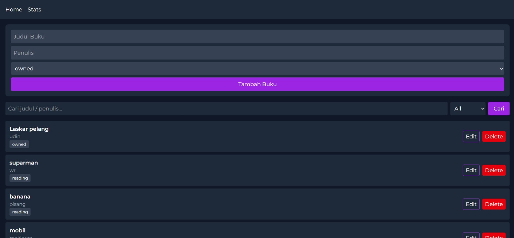
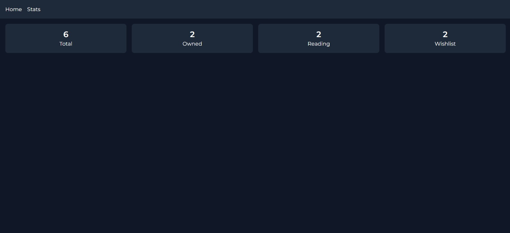
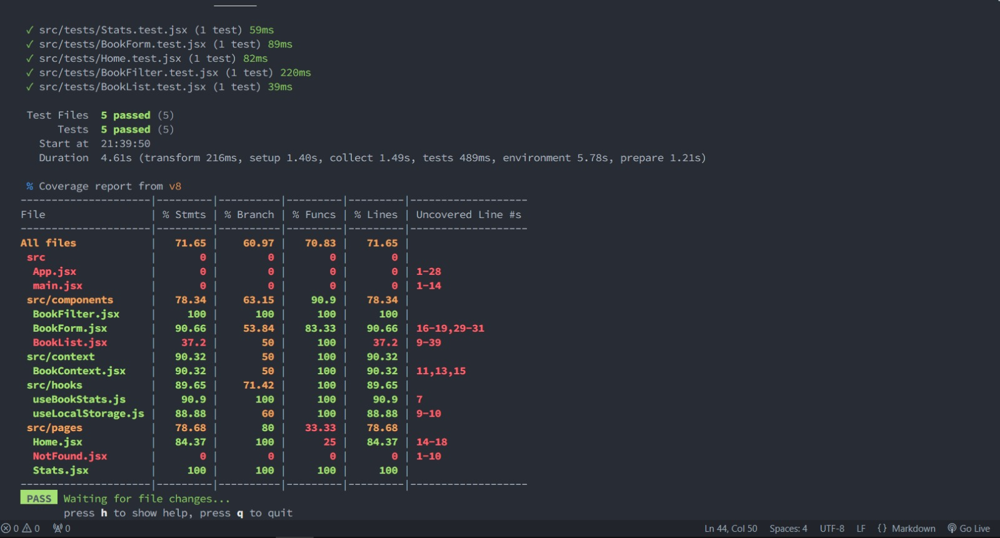

# My Book Manager App

Aplikasi web sederhana untuk mencatat buku-buku pribadi:  
- **Tambah/Edit/Hapus** buku (judul, penulis, status: owned/reading/wishlist).  
- **Filter & Search** di satu halaman dengan tombol “Cari”.  
- **Statistik** via halaman Stats (total per status).  
- Styling **modern minimal**: dark bg, aksen ungu `#9B25E3`, font Montserrat, full Tailwind CSS v4 CSS‑first.  

---

## 🚀 Instalasi & Menjalankan

1. Clone repo:  
   ```bash
   git clone <repo-url>
   cd my-book-app
   ```

2. Install dependencies:  
   ```bash
   npm install
   ```

3. Jalankan development server:  
   ```bash
   npm run dev
   ```

4. Buka browser di `http://localhost:5173`

5. Untuk build production:  
   ```bash
   npm run build
   ```

---

## 🖼️ Screenshot Antarmuka

  
*Halaman Home: form tambah buku, filter & search*

  
*Halaman Stats: ringkasan jumlah buku per status*

---

## ⚛️ Fitur React yang Digunakan

- **Functional Components** dengan JSX  
- **Hooks**:  
  - `useState` & `useEffect` untuk state lokal & efek samping  
  - `useContext` + **Context API** untuk state global buku  
- **Custom Hooks**:  
  - `useLocalStorage` (sync state ↔ localStorage)  
  - `useBookStats` (hitung statistik buku)  
- **React Router v6** untuk navigasi SPA (`Home`, `Stats`, `NotFound`)  
- **PropTypes** untuk type‑checking props  
- **Vite** sebagai bundler & dev server  
- **Tailwind CSS v4 CSS‑first**:  
  - Semua kustom tema (font, color vars) di `src/styles.css` via `@import`, `@theme`, `@layer`  
  - No separate config files  
- **Testing**:  
  - **Vitest** dengan `globals: true`, environment `jsdom`  
  - **React Testing Library** + **@testing-library/jest-dom**  
  - Minimal 5 unit tests mengikuti best practices  

---

## ✅ Hasil Test

  

```bash
npm run test
```

Semua 5 test harus lulus:  
- `BookForm.test.jsx`  
- `BookFilter.test.jsx`  
- `BookList.test.jsx`  
- `Home.test.jsx`  
- `Stats.test.jsx`  